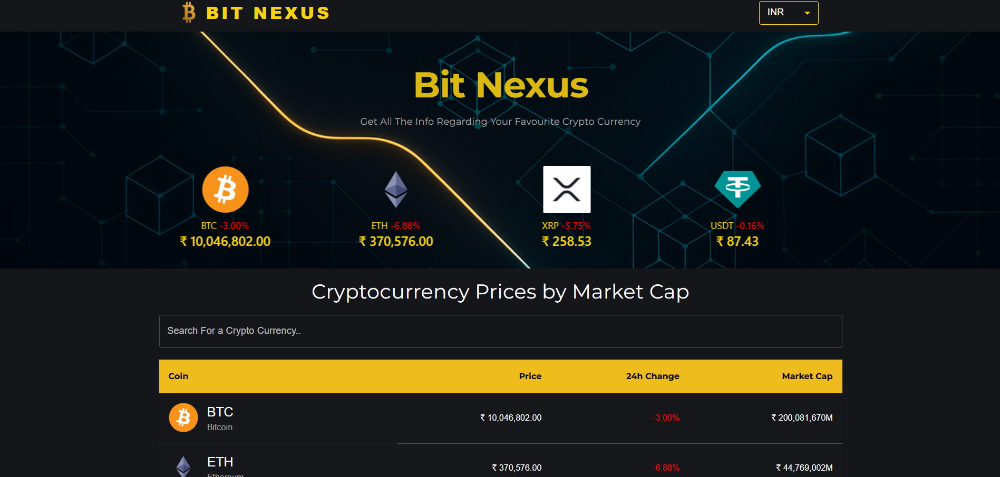

# 🚀 Bit_Nexus

A modern **Crypto Tracker App** built with **React** and powered by the [CoinGecko API](https://www.coingecko.com/en/api).  
Bit_Nexus lets you explore real-time cryptocurrency data, interactive charts, and portfolio insights with smooth UI/UX.

---

## ✨ Features

- 📊 **Real-time Market Data** – Live updates from CoinGecko API  
- 📈 **Interactive Graphs** – Historical price trends with charts  
- 🔐 **Authentication** – Secure login/signup for personalized tracking  
- 🌍 **Global Market Overview** – Market cap, volume, trending coins, and more  
- 🔎 **Search & Filter** – Quickly find your favorite coins  
- 📱 **Responsive Design** – Works across desktop and mobile  

---

## 🖥️ Tech Stack

- ⚛️ **React.js** – Frontend framework  
- 🎨 **Material-UI / Tailwind** (your choice) – Styling and UI components  
- 🔌 **CoinGecko API** – Real-time crypto data source  
- 📊 **Chart.js / Recharts** – Data visualization for price trends    

---
---

## 🌐 Live Demo

Check out Bit_Nexus live here: [Live Demo Link](https://abhijitmukherjee36.github.io/Bit_Nexus)

## 📸 Preview

 
---

## 📸 Preview

### 🏠 Home Page

  

### 💰 Coin Info

  

---

